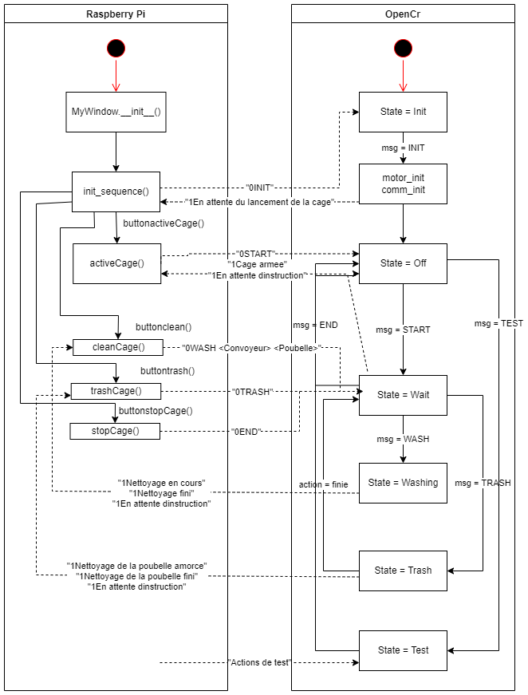

# Dossier *Main*

Ce présent document comporte les informations pertinentes sur les fichiers main du système.

1. [Descriptions des fichiers](#1-description-des-fichiers)
2. [Structure du programme](#2-structure-du-programme)

## 1. Description des fichiers

Les fichiers de ce dossier assurent la communication entre le Raspberry Pi, la carte OpenCR et la caméra Pi et contiennent la machine à état générale du code, en d'autres termes la séquence d'éxécution.

- **functions_Comm** : Fichier contenant les différentes fonctions pour envoyer, recevoir et attendre des messages de la carte OpenCR.
- **init_stop_Sequences** : Fichier contenant les différentes fonctions d'initialisation de composantes ou de séquence, de lancements d'états.

## 2. Structure du programme

### 2.1 Communication Pi et OpenCR

### 2.2 Algorithme d'utilisation de la caméra dans la séquence

