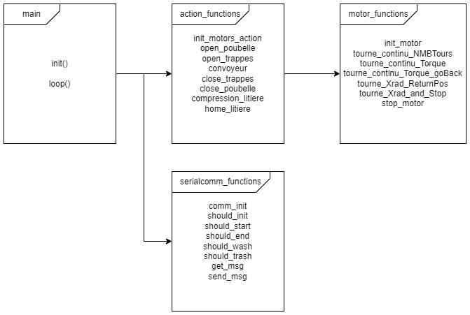

# *OpenCR\main* folder

Le dossier main est celui à exécuter sur la carte Open CR àpartir de l'application Arduino IDE dont l'installation est expliquée [ici](../../../README.md).

## Fichiers

- **main.ino**: Fichier contenant la machine a état. Appelle les actions possibles, exemple: nettoyer la cage de *action_function.cpp*. Ce fichier appelle les fonctions de *action_functions.cpp* et *serialcomm_functions.cpp*.
- **serialcomm_functions.cpp**: Fichier contenant les fonctions de communications en port serie avec le Pi.
- **motor_functions.cpp**: Fichier contenant les fonctions des mouvements de moteurs et des constantes touchant directement les moteurs, exemple: vitesse, délai, position pour x nmb de tours. 
- **action_functions.cpp**: Fichier contenant les fonctions de nettoyages utilisant les moteurs et des constantes, l'id des moteurs, des positions et mouvements propre aux actions . Ces fonctions séfinissent ce que sont les differents actions de la cage, exemple: ouvrir les trappes et partir le convoyeur. Le fonctions appellent les fonctions générales d'utilisation de moteur (*motor_functions.cpp*). Ce fichier appelle les fonctions de *motor_functions.cpp*

## Structure du programe

