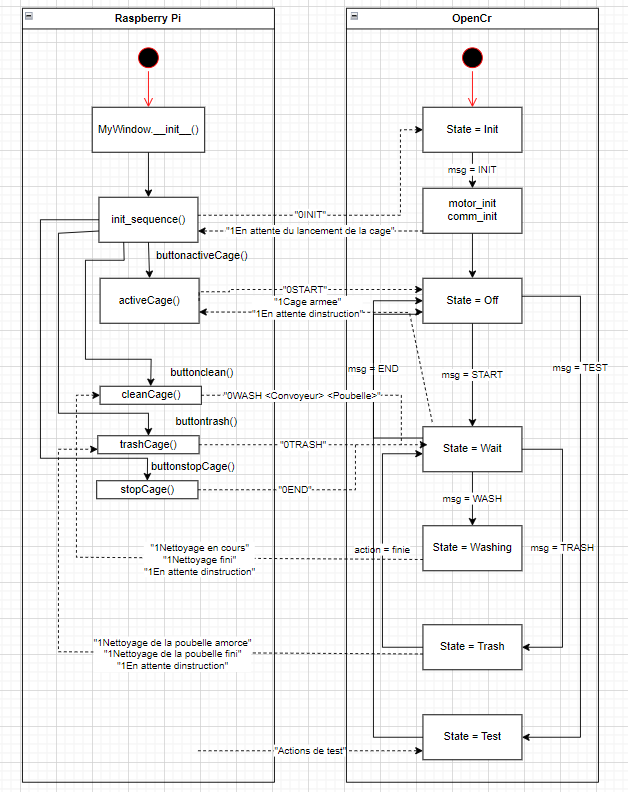

# Dossier *OpenCR\main* 

Le dossier main est celui à exécuter sur la carte Open CR à partir du logiciel Arduino IDE dont l'installation est expliquée [ici](../../../README.md).

## Fichiers

- **main.ino**: Fichier contenant la machine à état. Appelles les actions possibles, par exemple nettoyer la cage de *action_function.cpp*. Ce fichier appelle les fonctions de *action_functions.cpp* et *serialcomm_functions.cpp*.
- **serialcomm_functions.cpp**: Fichier contenant les fonctions de communications par port série avec le Rapsberry Pi.
- **motor_functions.cpp**: Fichier contenant les fonctions de mouvements des moteurs et des constantes touchant directement les moteurs, par exemple la vitesse, le délai, la position pour x nombre de tours. 
- **action_functions.cpp**: Fichier contenant les fonctions de nettoyages utilisant les moteurs et des constantes, les ID des moteurs, des positions et mouvements propres aux actions. Ces fonctions définissent les differents actions de la cage, par exemple ouvrir les trappes et partir le convoyeur. Les fonctions appellent les fonctions générales d'utilisation de moteurs (*motor_functions.cpp*). Ce fichier appelle les fonctions de *motor_functions.cpp*

## Notes 

Lors de l'initialisation des moteurs dynamixel, s'assurer que tous les moteurs ont un ID different, le tout peut être possible grâce au code du fabricant retrouvé dans les exemples (p_monitor). 

### Structure du programe

## Communication Pi et OpenCR

## Structure de la séquence de nettoyage

