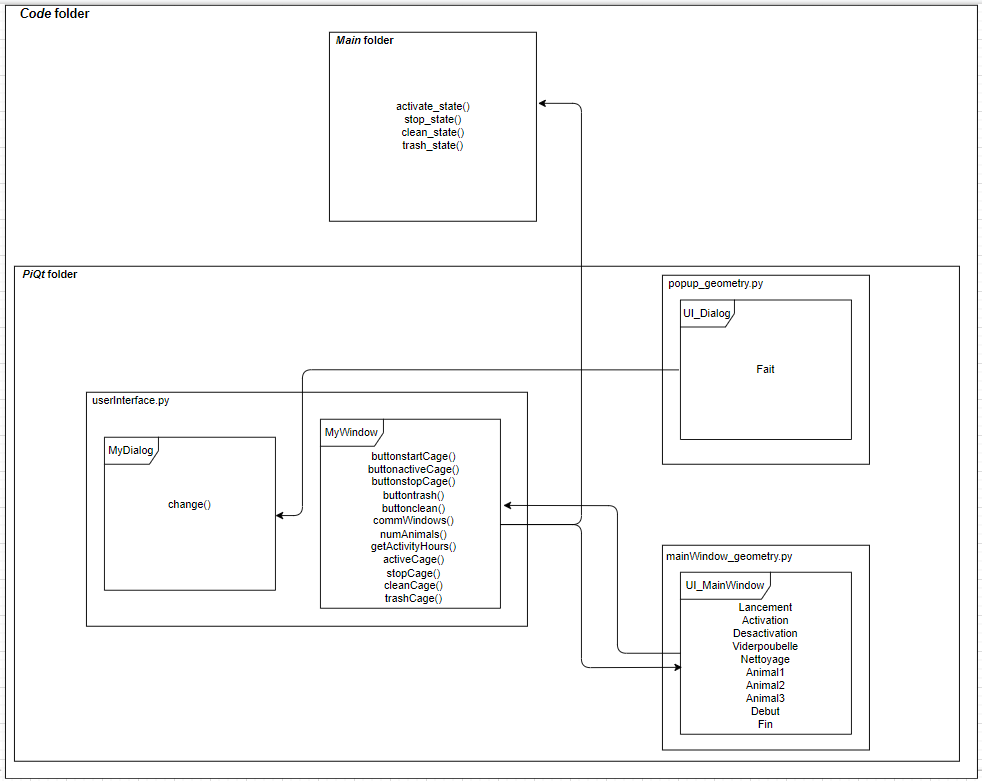

# Dossier *PyQt*

Le présent document comporte des informations pertinentes sur l'interface utilisateur et ses programmes.

1. [Description des fichiers](#1-description-des-fichiers)
2. [Structure du programme](#2-structure-du-programme)

## 1. Description des fichiers

Il y a deux types de fichiers dans ce dossier, des .py et des .ui. Les fichiers .ui peuvent être ouverts avec QT 5 Designer, dont l'installation est expliquée [ici](../../README.md/#321-installation-de-qt-designer), sur le Pi et les fichiers .py avec Visual Studio Code. 

- **mainWindow_geometry.py** : Fichier contenant la fenêtre principale du HMI en Python.
- **mainWindow_geometry.ui** : Fichier représentant graphiquement la fenêtre principale du HMI.
- **popup_geometry.py** : Fichier contenant la fenêtre pop-up (qui s'ouvre lorsque la poubelle doit être vidée) du HMI en Python.
- **popup_geometry.ui** : Fichier représentant graphiquement la fenêtre pop-up du HMI.
- **userInterface.py** : Fichier main gérant la communication entre l'interface graphique et les autres composantes du système et entre les fenêtres de l'interface.

### 1.1 Conversion des fichiers .ui en .py

Les fenêtres de l'interface utilisateur sont initialement conçues dans QT 5 Designer en fichier .ui. Enfin d'associer des actions aux différentes composantes de ces fenêtres, il faut convertir ces fichiers .ui en fichiers .py, et ce, en éxécutant la ligne de commande ci-dessous dans le dossier contenant les fichiers :

```
  $ pyuic5 –x nom.ui -o nom.py 
```

## 2. Structure du programme


