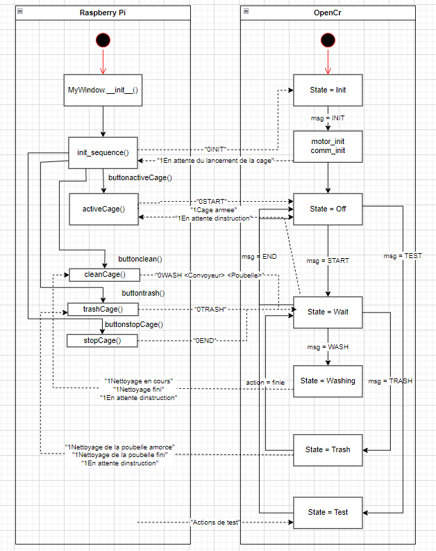

# Architechture générale du programme

Le programme contenu dans le dossier OpenCR/main doit etre compilé par un ordinateur sur Arduino IDE apres l'installation décrite [Ici](../README.md). Le code est défini [dans ce document ci](OpenCR/main/README.md).

Le programme contenu dans le dossier PiQt est a compiler sur le Raspberry-Pi et celui ci utilise les fichiers dans PiCamera et Main. l'installation du Pi est décrite [Ici](../README.md). Le code est défini dans ces trois documents: [PiQt](PiQt/README.md), [Main](Main/README.md) et [PiCamera](PiCamera/README.md).

## Communication Pi et OpenCR

