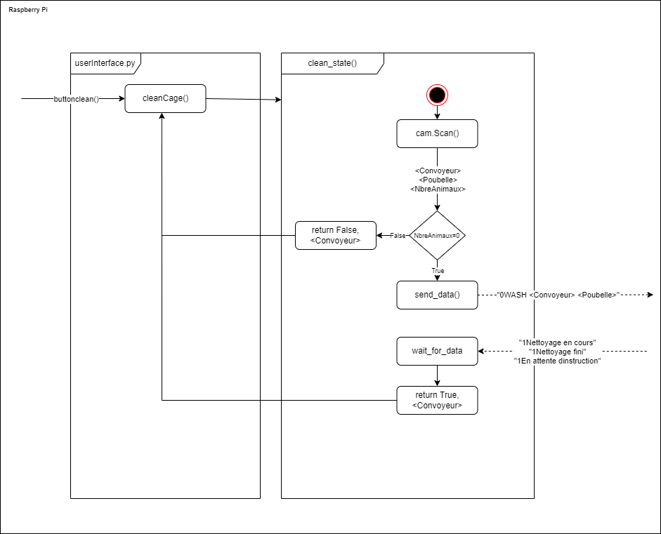

# Architechture générale du programme

Ce présent document explique de façon générale où doivent être compilés les fichiers du système.

1. [OpenCR](#1-opencr)
2. [Raspberry Pi](#2-raspberry-pi)
3. [Algorithme d'éxécution des séquences](#3-algorithme-déxécution-des-séquences)

## 1. OpenCR

Le programme contenu dans le dossier OpenCR/main doit etre compilé par un ordinateur sur Arduino IDE apres l'installation décrite [ici](../README.md). Le code est défini [dans ce document ci](OpenCR/main/README.md).

## 2. Raspberry Pi

Le [programme] (PyQt/userInterface.py) contenu dans le dossier PyQt doit être compilé sur le Raspberry Pi et celui-ci utilise les fichiers dans PiCamera et Main. L'installation du Rapberry Pi est décrite [Ici](../README.md). Le code est défini dans ces trois documents: [PyQt](PyQt/README.md), [Main](Main/README.md) et [PiCamera](PiCamera/README.md).

## 3. Algorithme d'éxécution des séquences

