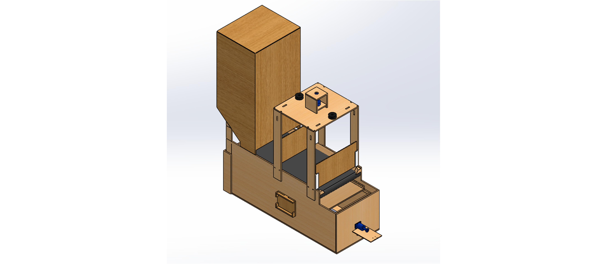
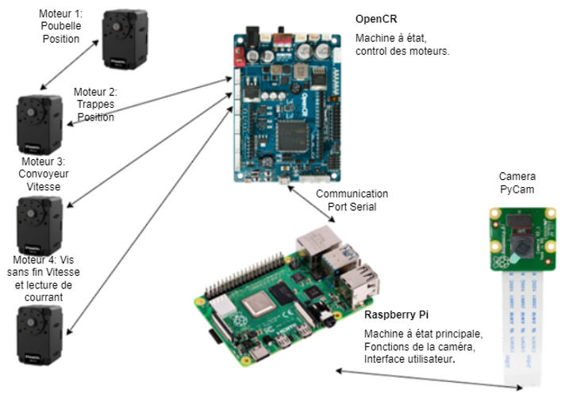

# Cagius

Cagius est un projet open source ayant pour objectif de concevoir et construire le mécanisme de gestion de la litière pour une cage à petits animaux automatisée et créer un interface programmable pour gérer les cycles de nettoyage.



## Table des matieres

1. [Composantes mécaniques et électroniques](#1-composantes-mécaniques-et-électroniques)
2. [Assemblage](#2-assemblage)
3. [Installation logiciel](#3-installation-logiciel)
4. [Initialisation de la cage](#4-initialisation-de-la-cage)
5. [License](#5-license)

## 1. Composantes mécaniques et électroniques

### 1.1 Composantes mécaniques

- Courroie Synchrone : McMaster **1679K55** 
- Tige Filletée : Mcmaster **98957A154**

### 1.2 Composantes électroniques

- Raspberry Pi 4
- Raspberry Pi Camera
- 2 x Dynamixel XL-430-w250-t
- 2 x Dynamixel XM-430-w350-t
- Module à relais IDUINO - 1 Canal - 5V (ST1080)



## 2. Assemblage

Pour ce qui est de l'assemblage de la structure de base, il suffit de respecter l'assemblage de la pièce [PoubelleV3.sldrpt](https://github.com/Cagius-UdeS/Cagius/blob/main/CADs/Poubelle.SLDPRT). En fait, un mélange de colle et de clou à finition a été utilisé pour avoir une structure solide. De plus, le prototype actuelle est fait avec des planches de bois 1/4" découpées au laser et assemblées par la suite. Enfin, les pièces [rail.sldprt](https://github.com/Cagius-UdeS/Cagius/blob/main/CADs/Poubelle.SLDPRT) et [trape_horizontal.sldprt](https://github.com/Cagius-UdeS/Cagius/blob/main/CADs/trappe_horizontal.SLDPRT) sont collées ensemble et forme la trappe à l'avant de la poubelle au niveau du plancher médian.

Pour ce qui est de l'assemblage du convoyeur, des tubes de PVC de 1" ont été utilisé accompagnés d'adaptateurs imprimés en 3D pour les assembler avec la cage et le moteur. De plus, des bandes élastiques d'entrainements sont utilisées comme courroie pour transmettre le mouvement d'une poulie à l'autre.

[Pour les détails concernants les CADs et leurs pertinances](https://github.com/Cagius-UdeS/Cagius/blob/main/Documentation/Hierarchie_pieces.md)

## 3. Installation logiciel

La section suivante couvre l'installation des logiciels et des librairies nécessaires à la compilation du code.

### 3.1 Installation sur ordinateur

Il est nécessaire de compiler et d'envoyer le code à la carte OpenCR à partir d'un ordinateur, car le Raspberry Pi ne prend pas en charge les librairies de la carte OpenCR et des moteurs Dynamixel.

#### 3.1.1 Installation de Arduino IDE

Afin d'installer Arduino IDE et les librairies nécessaires pour coder les moteurs, il suffit de suivre les étapes suivantes :

1. Télécharger l'application Arduino IDE [ici](https://www.arduino.cc/en/software)
2. Ouvrir l'application et se rendre dans *Fichier*, puis *Préférences*
3. Dans la section *URL de gestionnaire de cartes supplémentaires*, rajouter la ligne suivante:
	`https://raw.githubusercontent.com/ROBOTIS-GIT/OpenCR/master/arduino/opencr_release/package_opencr_index.json`
4. Confirmer les changements en pressant *OK* dans le bas à droite de l'écran.
5. Enfin, installer les librairies Motorcontrole dans la section *Outils* puis *Type de carte* et *Gestionnaire de carte*. Taper OpenCR dans la barre de recherche et installer les librairies.

#### 3.1.2 Installation des librairies pour OpenCR

Afin de pouvoir compiler le code de la carte OpenCR, il est nécessaire d'installer quelques librairies selon les étapes suivantes :

1. Ouvrir l'application Arduino IDE et se rendre dans *Croquis*, puis *Inclure une bibliothèque* et sélectionner *Gestionnaires de bibliothèques*

2. Rentrer *Dynamixel* dans la barre de recherche

3. Installer les libraires

### 3.2 Installation sur Raspberry Pi

Le Raspberry Pi agit comme le cerveau de la cage. En effet, le Raspberry Pi analyse la caméra et l'interface utilisateur.

#### 3.2.1 Installation de Qt designer

Si vous voulez modifier l'interface utilisateur (modifier les fichiers .ui), vous devez télécharger Qt 5 Designer, qui fait parti de Qt Creator. Pour cela, éxecutez les lignes de commandes suivantes dans le terminal :

  ```
  $ sudo apt-get install qttools5-dev-tools
  $ sudo apt-get install qttools5-dev
  ```

#### 3.2.2 Installation de PyQt

Pour concevoir le HMI, nous avons utilisé PyQt qui est un module libre permettant de lier le langage Python avec la bibliothèque Qt. 
L'installation se fait sur le Raspberry Pi et consiste à faire rouler la ligne de commande suivante :

	$ sudo apt-get install python3-pyqt5

Si votre Rapsberry Pi n'est pas à jour, rouler ces lignes de commande au préalable :

	$ sudo apt-get update
	$ sudo apt-get upgrade

À partir de là, pour coder l'interphace graphique on utilise Qt 5 Designer avec le PyQt intégré.

#### 3.2.3 Installation des librairies Open CV

Afin d'installer les librairies OpenCV sur votre Raspberry Pi, 
il suffit de suivre le guide **Setting Up Open-CV for Object Detection** sur ce site:
[Guide d'installation OpenCV](https://core-electronics.com.au/tutorials/object-identify-raspberry-pi.html)

## 4. Initialisation de la cage

Les differents dossiers de code et où les compiler se retrouve [ici](Code/README.md)

## 5. License

License de [Apache](LICENSE).
